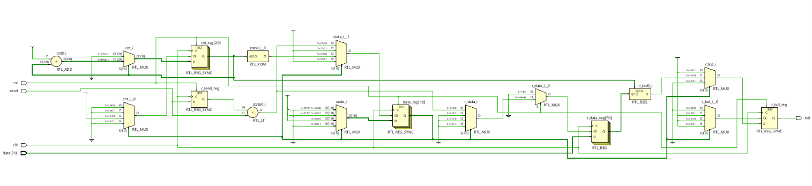
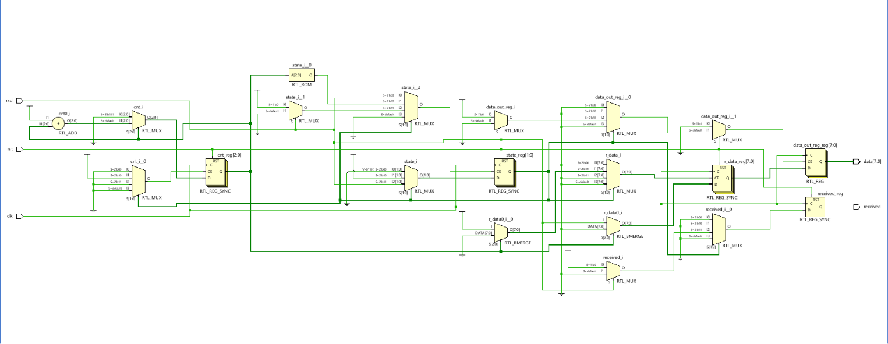
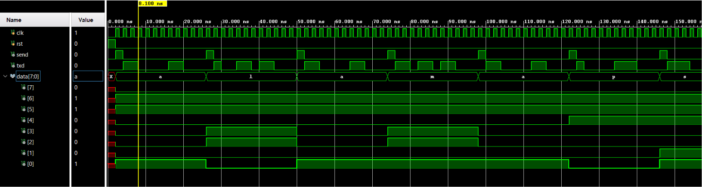

# Custom UART Transceiver with Python Verification


This repository contains the RTL design, hardware synthesis analysis, and automated verification environment for a custom asynchronous serial transceiver (UART-like TX/RX) implemented in **Verilog HDL**. 

The project demonstrates hardware design using Finite State Machines (FSMs), resolution of hardware-specific issues (e.g., output glitching via double-buffering), and testbench techniques using Verilog File I/O and a Python reference model.

## Project Objective

The primary goal of this project was to design a robust serial communication interface and prove its functional correctness using a "bottom-up" verification approach. Key focus areas include:
- Designing synthesizable **Finite State Machines (FSMs)** for data serialization and deserialization.
- Hardware-Software Co-verification using File I/O simulation IPs and a **Python Oracle Script**.
- Hardware optimization and signal integrity (resolving shift-register output glitching).

## Architecture & Finite State Machines

The transceiver operates on a custom framing protocol tailored for this project: **Start Bit = 1**, **8 Data Bits (LSB-first)**, and **Stop Bit = 0**. Both the Transmitter (`uart_tx.v`) and Receiver (`uart_rx.v`) are driven by dedicated FSMs.

### Transmitter (TX) FSM
1. **STATE0 (Idle):** Waits for the rising edge of the `send` flag. Latches parallel input data.
2. **STATE1 (Start):** Asserts the start bit (`1`) onto the TX line.
3. **STATE2 (Data Shift):** Shifts out the 8-bit payload (LSB first) using an internal counter.
4. **STATE3 (Stop):** Asserts the stop bit (`0`) and returns to Idle.

### Receiver (RX) FSM & Hardware Fix (Double Buffering)
The RX module samples the incoming serial line and reconstructs the parallel byte. 
* **Initial Design Challenge:** During initial loopback testing, the receiver output (`data_rx`) exhibited intermediate state glitches (random ASCII characters). This occurred because the internal shift register was directly exposed to the output port, showing the data bits changing in real-time.
* **Hardware Solution:** To ensure signal integrity, a **Double-Buffering** architecture was introduced. A dedicated output register (`data_out_reg`) was added. The shift register (`r_data`) now gathers bits privately, and its contents are clocked into the output buffer *only* in `STATE3` when the stop bit is validated and the `received` flag is asserted. This ensures downstream modules always read stable, valid data.

## Hardware Synthesis (RTL Analysis)

Below are the Elaborated Design schematics from Xilinx Vivado, confirming the correct inference of the sequential logic.

### TX Module RTL

*(Note: The schematic shows the TX FSM, the internal bit counter (`cnt_reg`), and the multiplexing logic used to serialize the parallel input data onto the single `txd` wire.)*

### RX Module RTL

*(Note: The schematic highlights the RX FSM (`state_reg`), the bit counter, the internal shift register (`r_data_reg`), and the crucial double-buffering output register (`data_out_reg`) added to prevent output glitching.)*

## Verification Methodology & Results

The verification was conducted in two stages, utilizing a "bottom-up" approach to ensure both mathematical correctness and system-level data integrity. The testbenches strictly separate synthesizable RTL code from non-synthesizable simulation code (Verification IPs using `$fopen`, `$fgetc`, `$fwrite`).

### Stage 1: Transmitter (TX) Unit Test & Oracle Verification
The `uart_tx` module was isolated (`tb_uart_tx.v`). Raw bytes were injected into the FSM from a binary file (`dane_we.bin`).


**Waveform Insights:** The zoomed-in waveform captures the transmission of a single character ('a' / `0x61`). You can clearly observe the custom frame: the Idle state, the Start bit (`1`), the LSB-first data shift, and the Stop bit (`0`). The module operates with maximum throughput, showing only a 2-cycle idle gap between back-to-back transmissions.

**Python Automated Verification:** The simulated serial bitstream was dumped to `dane_wyj.bin`. A custom Python oracle script (`scripts/read.py`) reads the original input, mathematically generates the expected serial bitstream, and compares it against the Vivado output.

```text
loaded text: 'alamapsaidwakoty'
Generate a math model with 192 bits.
Read results from Vivado simulation, length: 192 bits.

[ RESULT: SUCCESS! ]
Expected start:  011000011000010011011000011000011000011011011000011000011000
Vivado start:    011000011000010011011000011000011000011011011000011000011000

```

### Stage 2: Full System Loopback Test

With the TX module verified, the receiver (`uart_rx.v`) was integrated to create a full transceiver loopback (`tb_uart_system.v`). The TX serial output (`txd`) was directly wired to the RX serial input (`rxd`).


**Waveform Insights:** This system-level waveform captures the complete datapath. Thanks to the double-buffering fix mentioned earlier, the `data_rx` bus transitions perfectly and cleanly (e.g., from 'a' to 'l') exactly when the `received` flag pulses. There is zero glitching. The reconstructed bytes were written back into a text file (`dane_ascii_wyj.txt`), completely matching the original input, proving 100% end-to-end data integrity.

## Repository Structure & Reproduction

To maintain a clean version control history, this repository does not include heavy, auto-generated Vivado project files.

```text
custom_uart_transceiver/
├── src/                # Synthesizable RTL (TX and RX FSMs)
├── sim/                # Verilog Testbenches and File I/O Verification IPs
├── scripts/            # Python golden model verification script
├── data/               # Input/Output binary and text payloads
├── docs/               # Documentation, schematics, and waveforms
└── build_project.tcl   # Tcl script to recreate the Vivado project

```

**How to recreate the Vivado project locally:**

1. Clone this repository.
2. Open **Xilinx Vivado**.
3. In the Vivado **Tcl Console**, change directory to the cloned repository:
```tcl
cd C:/Path/To/Your/Cloned/Repo/custom_uart_transceiver

```


4. Run the build script:
```tcl
source build_project.tcl

```


5. Vivado will automatically recreate the project, configure relative paths, import sources/simulations, and set up the environment. You can then run the Behavioral Simulation or the Synthesis.

```