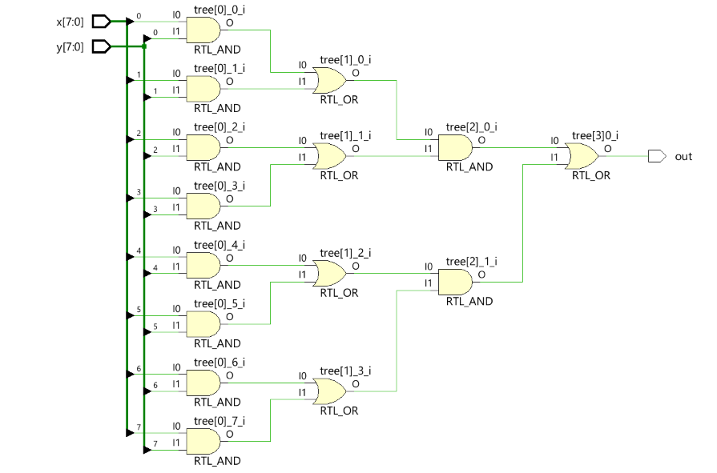
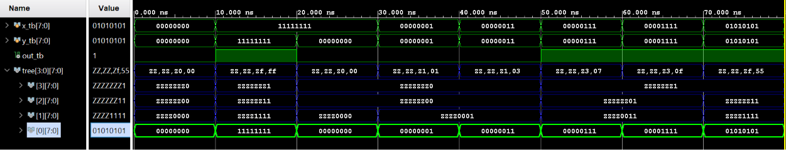

# FPGA Complex Logic Module Design – Portfolio Project

This repository presents the design and verification of a **Complex Logic Module** implemented in **Verilog HDL**. The project was developed as part of an advanced FPGA systems course and demonstrates the transition from structural logic design to more advanced behavioral modeling, parametric generation, and hardware synthesis using **Xilinx Vivado**.

## Project Objective

The main goal of this project was to design a multi-stage logic tree capable of processing 8-bit input vectors through alternating layers of logic gates (AND/OR). Key focus areas include:
- Scalable and parametric hardware design using advanced `generate` loops.
- Hardware synthesis analysis (understanding the mapping of combinational logic to FPGA LUT resources).
- Functional verification using automated **testbenches** and timing analysis.

## Logic Architecture & Parametric Generation

The module processes two 8-bit input vectors, `x` and `y`, through a four-stage logic tree, reducing the 16 input bits to a single output flag `out`. 

Instead of manually instantiating gates, the architecture leverages a highly optimized 2D wire array (`wire [7:0] tree [3:0]`) and a single `generate` block. By utilizing the modulo operator (`i % 2 == 1`), the synthesizer automatically alternates between OR and AND layers across the stages:

1. **Stage 0 (Input Layer):** Bitwise AND operation between `x[j]` and `y[j]`.
2. **Stage 1 (OR Layer):** Reduction from 8 bits to 4 bits using 2-input OR gates.
3. **Stage 2 (AND Layer):** Reduction from 4 bits to 2 bits using 2-input AND gates.
4. **Stage 3 (Output Layer):** Final reduction to a single output `out` using a 2-input OR gate.

### RTL Schematic
Below is the Elaborated Design schematic from Vivado, confirming the correct inference of the alternating combinational logic tree:

 
*(Note: Add a screenshot of the RTL Schematic from Vivado here)*

**Hardware Mapping Note:** In the actual Xilinx FPGA architecture, these discrete AND/OR gates are not implemented directly. Instead, Vivado's synthesis engine collapses this multi-stage combinational path and maps it efficiently into the 6-input **Look-Up Tables (LUTs)** within the Configurable Logic Blocks (CLBs).

## Simulation and Verification

To validate the design, a comprehensive testbench (`tb_modulo_logic.v`) was developed. The verification strategy focused on both edge cases and specific branch activations:
- **All Zeros / All Ones:** Baseline functionality checks.
- **Partial Tree Activation:** e.g., Activating only the right half of the tree (`x = 0x0F`, `y = 0x0F`).
- **Alternating Bit Patterns:** e.g., Activating every second bit (`0x55`) to verify independent branch propagation without crosstalk.

### Simulation Waveform
The simulation waveform confirms correct functional behavior with 0-cycle latency (purely combinational logic).


*(Note: Add a screenshot of the XSim waveform showing the test vectors here)*

## Repository Structure & Reproduction

To maintain a clean version control history, this repository does not include heavy Vivado project files (`.xpr`). 

```text
complex_logic_module/
├── sim/                # Simulation files and testbenches
│   └── tb_modulo_logic.v
├── src/                # Synthesizable Verilog source code
│   └── modulo_logic.v
├── docs/               # Documentation and schematics
└── build_project.tcl   # Tcl script to recreate the Vivado project